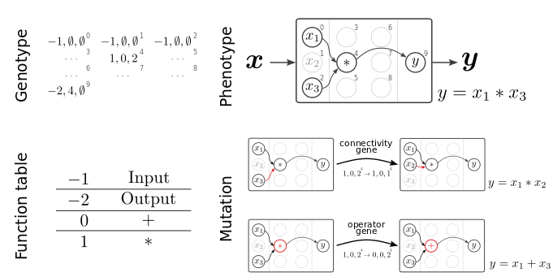

========
 HAL-CGP
========

.. image:: https://badge.fury.io/py/hal-cgp.svg
    :target: https://badge.fury.io/py/hal-cgp
.. image:: https://img.shields.io/badge/python-3.6-red.svg
	   :target: https://www.python.org/downloads/release/python-369/
.. image:: https://img.shields.io/badge/python-3.7-red.svg
	   :target: https://www.python.org/
.. image:: https://img.shields.io/badge/python-3.8-red.svg
	   :target: https://www.python.org/
.. image:: https://img.shields.io/badge/License-GPLv3-blue.svg
	   :target: https://www.gnu.org/licenses/old-licenses/gpl-3.0.html
.. image:: https://travis-ci.org/Happy-Algorithms-League/hal-cgp.svg?branch=master
	   :target: https://travis-ci.org/Happy-Algorithms-League/hal-cgp
.. image:: http://www.mypy-lang.org/static/mypy_badge.svg
	   :target: http://mypy-lang.org/
.. image:: https://img.shields.io/badge/code%20style-black-000000.svg
	   :target: https://github.com/psf/black
.. image:: https://coveralls.io/repos/github/Happy-Algorithms-League/python-gp/badge.svg?branch=master
	   :target: https://coveralls.io/github/Happy-Algorithms-League/python-gp?branch=master
.. image:: https://readthedocs.org/projects/ansicolortags/badge/?version=latest
	   :target: https://happy-algorithms-league.github.io/hal-cgp/

Cartesian genetic programming (CGP) in pure Python.

hal-cgp is an extensible pure Python library implementing Cartesian genetic programming to represent, mutate and evaluate populations of individuals encoding symbolic expressions targeting applications with computationally expensive fitness evaluations. It supports the translation from a CGP genotype, a two-dimensional Cartesian graph, into the corresponding phenotype, a computational graph implementing a particular mathematical expression. These computational graphs can be
exported as pure Python functions, NumPy-compatible functions (Walt et al., 2011), SymPy expressions (Meurer et al., 2017) or PyTorch modules (Paszke et al., 2019).

The library implements a mu + lambda evolution strategy (Beyer and Schwefel, 2002) to evolve a population of individuals to optimize an objective function.

.. image-start
   

	 
Figure from Jordan, Schmidt, Senn & Petrovici, "Evolving to learn: discovering interpretable plasticity rules for spiking networks", arxiv:2005.14149_.

.. _arxiv:2005.14149: https://arxiv.org/abs/2005.14149

.. image-end

.. long-description-end

.. installation-start
============
Installation
============

You can install the latest relase via pip:

   .. code-block:: shell

      pip install hal-cgp

This library depends on some optional packages defined in `extra_requirements.txt`. These are necessary, for example, to compile an individual to a SymPy expression or a PyTorch class. You can install the extra requirements for full functionality of the library via:

   .. code-block:: shell

      pip install hal-cgp[extra]

You can also install individual extra requirements by specifying the package name (without version number) in square brackets, e.g., to install the `torch` dependency:

   .. code-block:: shell

      pip install hal-cgp[torch]

The adventurous can install the most recent development version directly from our master branch (don't use this in production unless there are good reasons!):

   .. code-block:: shell

      git clone git@github.com:Happy-Algorithms-League/hal-cgp.git
      cd hal-cgp
      pip install .[all]

.. installation-end

===========
Basic usage
===========

For detailed documentation, please refer to `https://happy-algorithms-league.github.io/hal-cgp/ <https://happy-algorithms-league.github.io/hal-cgp/>`_. Here we only provide a preview.

.. basic-usage-start

Follow these steps to solve a basic regression problem:

1. Define an objective function.
   The objective function takes an individual as an argument and updates the `fitness` of the individual.

   .. code-block:: python
		
      def objective(individual):
          individual.fitness = ...
	  return individual

2. Define parameters for the population, the genome, the evolutionary algorithm and the evolve function.
   
   .. code-block:: python

      population_params = {"n_parents": 10, "mutation_rate": 0.5, "seed": 8188211}

      genome_params = {
           "n_inputs": 2,
   	   "n_outputs": 1,
	   "n_columns": 10,
	   "n_rows": 2,
	   "levels_back": 5,
	   "primitives": (cgp.Add, cgp.Sub, cgp.Mul, cgp.Div, cgp.ConstantFloat),
	   }

      ea_params = {"n_offsprings": 10, "tournament_size": 2, "n_processes": 2}

      evolve_params = {"max_generations": 1000, "min_fitness": 0.0}

3. Initialize a population and an evolutionary algorithm instance:

   .. code-block:: python

      pop = cgp.Population(**population_params, genome_params=genome_params)
      ea = cgp.ea.MuPlusLambda(**ea_params)

4. Define a callback function to record information about the progress of the evolution:

   .. code-block:: python

      history = {}
      history["fitness_parents"] = []
      def recording_callback(pop):
          history["fitness_parents"].append(pop.fitness_parents())

5. Use the `evolve` function that ties everything together and executes the evolution:

   .. code-block:: python
		
      cgp.evolve(pop, obj, ea, **evolve_params, print_progress=True, callback=recording_callback)

.. basic-usage-end

.. references-start
==========
References
==========

Beyer, H.-G. and Schwefel, H.-P. (2002). Evolution strategies–a comprehensive introduction. Natural computing, 1(1):3–52.

Meurer, A., Smith, C. P., Paprocki, M., Certik, O., Kirpichev, S. B., Rocklin, M., ... & Rathnayake, T. (2017). SymPy: Symbolic Computing in Python. PeerJ Computer Science, 3, e103.

Miller, J. and Thomson, P. (2000). Cartesian genetic programming. In Proc. European Conference on Genetic Programming, volume 1802, pages 121-132. Springer.

Miller, J. F. (2011). Cartesian genetic programming. In Cartesian genetic programming, pages 17-34. Springer.

Paszke, A., Gross, S., Chintala, S., Chanan, G., Yang, E., DeVito, Z., ... & Lerer, A. (2017). Automatic Differentiation in PyTorch.

Topchy, A., & Punch, W. F. (2001). Faster Genetic Programming based on Local Gradient Search of Numeric Leaf Values. In Proceedings of the Genetic and Evolutionary Computation Conference (GECCO-2001) (Vol. 155162). Morgan Kaufmann San Francisco, CA, USA.

Walt, S. v. d., Colbert, S. C., and Varoquaux, G. (2011). The numpy array: a structure for efficient numerical computation. Computing in Science & Engineering, 13(2):22–30.

.. references-end
   
.. citation-start
   
Citation
========

If you use HAL-CGP in your work, please cite it as:

Schmidt, Maximilian & Jordan, Jakob (2020) hal-cgp: Cartesian genetic programming in pure Python. 
`10.5281/zenodo.3889163 <https://doi.org/10.5281/zenodo.3889163>`_

.. citation-end
