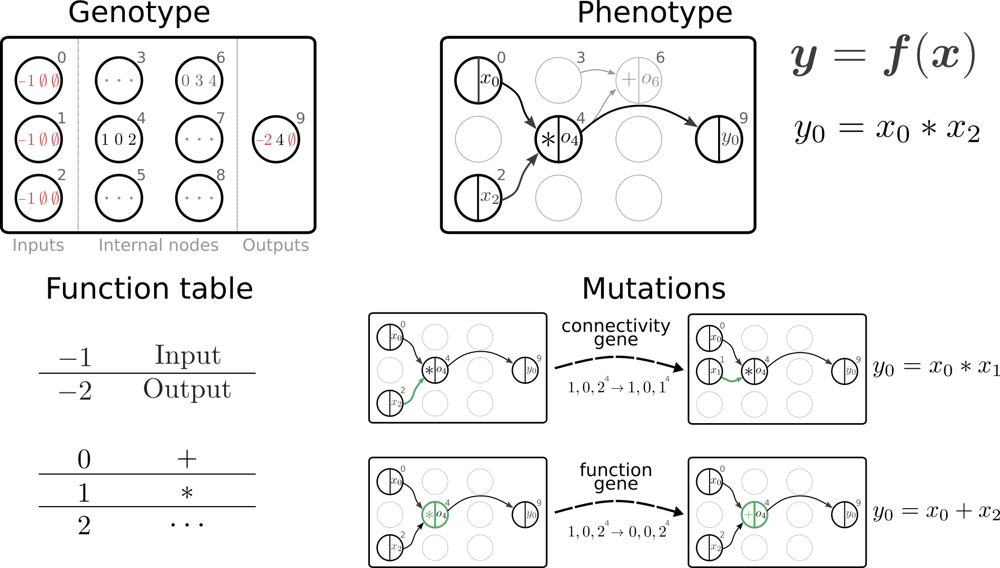

.. hal-cgp documentation master file, created by
   sphinx-quickstart on Sat Jul 11 12:53:25 2020.
   You can adapt this file completely to your liking, but it should at least
   contain the root `toctree` directive.

.. include:: ../README.rst
   :end-before: image-start

	 
Figure from Jordan, Schmidt, Senn & Petrovici, "Evolving to learn: discovering interpretable plasticity rules for spiking networks", arxiv:2005.14149_.

.. _arxiv:2005.14149: https://arxiv.org/abs/2005.14149

.. toctree::
   :maxdepth: 2

   installation
   basic_usage
   examples
   api_reference/api_reference
   references
   citation

.. automodule:: cgp
   :members:
       

.. Indices and tables
.. ==================

.. :ref:`genindex`
.. :ref:`modindex`
.. :ref:`search`
